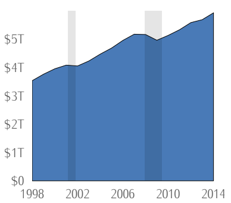

\newpage

\begingroup
\fontfamily{ppl}\fontsize{12}{16}\selectfont

# Introduction {-}

Inappropriate choice of marketing strategies may nip a new entrepreneurship in the bud, while an effective strategy will help the business get noticed by the consumers or end users. Strategies must be well prepared and adjusted to attract and retain target audience.


## Varied Entrepreneurial Ventures {-}

There are more than 10 different types of entrepreneurial ventures. Among them, three important types are small business, social entrepreneurship, scalable startup. Other examples include hustler, imitator, or research entrepreneurship, among others.

### Small Business Entrepreneurship {-}

People tend to venture in small business to support their family and a decent lifestyle, without aiming for large-scale profits [@ind_typ]. These businesses are usually owned and run by a single individual assisted by the family or local employees. Examples include local grocery stores, hairdressers, transportation, warehousing, and cleaning service, among numerous possible businesses. Job creation by small business is an important focal point for public policy [@Papadaki2002].

### Scalable Startup Entrepreneurship {-}

The entrepreneurs wishing for rapid expansion and big profit returns choose scalable startup entrepreneurship. Looking for untouched problems in the market and endeavor to create solutions, they may receive funding from venture capitalists and hire expert personnel. They endeavor to offer technological innovation and play a role in job creation, and increase the welfare of their citizens [@Susilo_1970].  Facebook, Instagram, and Uber are among the examples of scalable startup entrepreneurship [@ind_typ].

### Social Entrepreneurship {-}

Social entrepreneurs tasks themselves with social responsibility, producing their products and services to solve social problems, with the goal of the betterment of the society. Motivated to bring about social impacts, they usually do not intend to make big profits from their investment. However, depending on the business model, they can act as a non-profit, for-profit, or hybrid business. Grameen Bank is one of the most commonly cited example of an effective social entrepreneurship, TOMS (in USA) and GoodWeave (in Afghanistant) being other prominent examples [@crs23].


## Comparison among Different Types of Entrepreneurial Ventures {-}

| Types | Small Business | Scalable Startup | Social Entrepreneurship |
|---|---|---|---|
| 1. Targte Market | They target small number of people. | Aspiring to expand rapidly, they often target a global market | Rather than individual consumers, they often focus on social groups [@crs23]. |
| 2. Growth Potential | While by taking calculated risks and effective strategies, small businesses can grow, it is usually not what they initially desire. | Scalable start-ups focuses on high potential for growth and expected to increase volume as their capability and market demand increase. | They can grow as the groups they impact become large. |
| 3. Societal Benefits | They contribute to the society by creating job opportunities, diversifying the local marketplace, and building community identity [@olv]. | Scalable  start-ups  are able to  improve  the  economic condition of emerging economies with the help of local and foreign investment, resulting in an increase in GDP. They put forward economic benefits and improve living standards [@Susilo_1970]. | Social entrepreneurs have the potential to create employment and cause economic growth, transformative societal improvements, and new opportunities. |

## Significance of Small Businesses {-}

 According to Fundera, small businesses account for 64% of new jobs in the United States [@olv]. It has been seen that the number of small and medium enterprises (SME) in developed countries goes up to 90% of the total number of business units and they absorb 2/3 of the labour from all existing unemployment [@Herawati2020].

A study conducted in Indonesia [@ibr_ins] has shown that SMEs have proven as a self-sufficient business group that has a strong resistance in the face of the crisis. There were almost 53 million unit of SME in Indonesia and those units provide jobs to almost 100 million citizen of Indonesia. The economy census conducted by Central Bureau of Statistic (Badan Pusat Statistik/ BPS) in 2016 showed that out of 26.7 million businesses (apart from agriculture sector), 98.33% of them were SMEs. This provides a perception of how much small businesses can impact the society. SMEs rose in performance in the past few years which could be seen from the increased amount of development of SMEs each year. That rapid development in the SMEs sector showed that there is great potential to realise prosperous society [@Azevedo2019].

A study by @Kobe2018 shows that small business contributed $5.9 trillion to the $13.6 trillion in US private economy in 2014. Real GDP per employee was $103,000 for small business, while productivity payroll dollar was $2.44 for small businesses, while for large businesses, it was $2.20. The analysis also revealed Small Business GDP (SGDP) increased over the 1998 to 2014 period. As small businesses grow, they may change from a small businesses to large one or are acquired by a large enterprise.

```{r sbgdp, echo=FALSE, fig.cap = " Small Business Nominal GDP (1998-2014) in US economy", fig.align = 'center', out.width = '50%'}
knitr:: 
```

@Rondinelli1992 found that when the developing countries have grown, their exports and imports have been expanded, yet they have a small percentage of their labor forces in large-scale manufacturing and have a large share in small businesses.

## Barriers Faced by Small Businesses  {-}

Small businesses encounter numerous challenges in different stages of their business process. There are as many as 39 export barriers found by @Leonidou2004, including diosyncratic managerial, organizational, and environmental background, as well as information inefficiencies, price competitiveness, foreign customer habits, and politico-economic hurdles. Results of an analysis in Nigeria revealed that the most common factors hindering small business growth in the counrtry include lack of financial support, poor management, corruption, resource constraints, poor infrastructure, demand for products and services among others [@Okpara2009]. They also face challenges relating to trsut, marketing, poor NPD process, personal characteristics [@Larsen2006], and lack of union action.

Most of these challenges can be overcome by means of innovation. Some scholars have emphasised that professional associations, business advisory networks and government agencies can promote innovation among small entrepreneurs [@Signoretti2020].

## Effective Marketing Strategies {-}

```{r spotify, echo=FALSE, fig.cap = "Userbase of Spotify at 15 consist of Half a Million Subscribers. Source: Statista", fig.align = 'center', out.width = '70%'}
knitr:: 
```

**Spotify** is an audio streaming and media service provider, having over 602 million monthly active users and earning €13.25 billion in 2023. They took resort to a unique strategy by focusing on helping users discover new content, breaking the mold of the conventional music streamers. Their musics can be filtered by genre as well by users' mood, depending on whether they work out, sleep, or work. They also relied upon artificial intelligence to curate playlists based on their users’ habits, such as Release Radar and Discover Weekly [@Ortiz_2023]. As of December 2023, Spotify was the 47th most-visited website in the world.


**Nike** adopted another innovative strategy, which is dubbed ‘Nike By You’ social media marketing campaign [@Koshy_2024].The approach increased 22% of their revenue through this campaign alone. In this 2015 campaign, customers were the designers for the new Nike dunk low; the strategy has now been applied to all their current products. As of 2023, their revenue is $51.22 billion and rising.

# Conclusion {-}

All kinds of businesses have to face numerous challenges, but with the help of proper planning and a set of innovative and unique strategies, they can sustain and grow themselves. Small business, social, and scalable entrepreneurships are three of the most notable instances of ventures positively and remarkably impacting the world.

\endgroup

# References {-}

